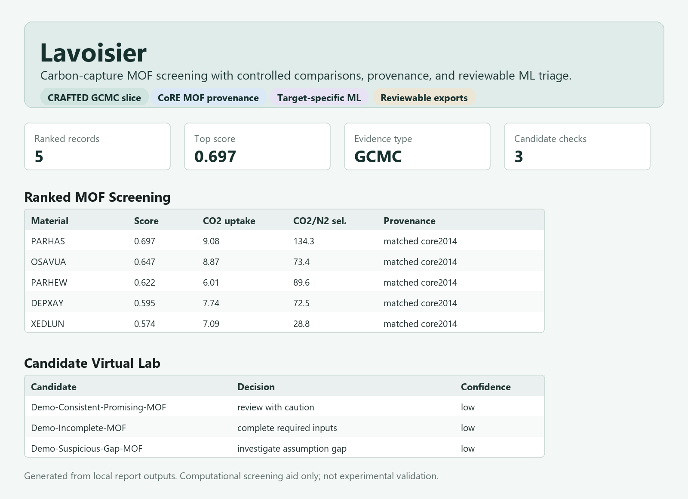

# Lavoisier

Lavoisier is a software-first chemical-engineering portfolio project: a transparent review tool for screening MOF carbon-capture adsorption records from public or user-supplied datasets.

The project does not claim to discover a new best material. It helps users compare records from a controlled MOF/GCMC screening slice, understand tradeoffs, and produce a reviewable shortlist with provenance and comparability warnings.



The canonical end-of-summer scope, milestones, and demo are defined in [`docs/end_of_summer_mvp_prd.md`](docs/end_of_summer_mvp_prd.md).

## MVP Snapshot

The current MVP is a local Streamlit app plus backend pipeline that can:

- load a controlled CRAFTED CO2/N2 MOF screening slice;
- validate required columns and units;
- filter records by controlled comparison scope;
- rank materials using adjustable criteria;
- explain selected-material score contributions from component scores and weights;
- expose excluded and blocked records for review instead of silently dropping them;
- flag tradeoffs such as high uptake but high regeneration penalty;
- enrich matched records with CoRE MOF 2014 structural provenance;
- train target-specific descriptor-based property predictors;
- compare synthetic unfamiliar candidates against descriptor-based estimates;
- export review packets, transformation logs, and screening reports.

Raw research datasets are not committed. The app reads locally generated reports when available and falls back to committed fixture outputs when the real local slice is unavailable.

For the system map, see [`docs/mvp_architecture.md`](docs/mvp_architecture.md).

## Why This Exists

Carbon-capture material screening is heavily studied in research settings. The software opportunity here is different: make complex screening data easier to inspect, rank, and review without overclaiming scientific certainty.

The tool is designed for human-in-the-loop screening:

```text
source registry -> dataset review -> schema validation -> ranking -> explainability -> human-approved shortlist
```

## What Is Real Vs Demo

- **Real pipeline work**: schema validation, controlled-slice filtering, ranking, provenance logging, CoRE descriptor enrichment, repeated-holdout ML evaluation, and virtual-lab report generation.
- **Real data source target**: CRAFTED 2.0.1 MOF adsorption screening data, processed locally after licence/provenance review.
- **Committed fallback data**: small fixture exports for opening the app without private or large raw datasets.
- **Demo candidate records**: synthetic unfamiliar MOF candidates used to demonstrate the review workflow.
- **Not claimed**: experimental validation, automated material discovery, DFT/GCMC execution, or unrestricted web scraping.

## Scope

Focus on MOFs for post-combustion-style CO2/N2 adsorption screening. The first target source is CRAFTED 2.0.1 after manual licence/provenance approval.

Candidate variables:

- material identifier
- material class
- source and provenance
- capture context
- simulation method
- force field
- charge method
- pressure
- temperature
- CO2 uptake
- N2 uptake
- CO2/N2 selectivity
- Henry coefficient
- heat of adsorption
- surface area
- pore volume
- pore limiting diameter
- largest cavity diameter
- density
- water or humidity indicator
- experimental vs computational status

## Not In Scope Yet

- generating new MOFs;
- running DFT, GCMC, or molecular dynamics;
- claiming experimental validity from computational predictions;
- scraping restricted sites;
- automatically ingesting data without licence/provenance review;
- treating different force fields, charge methods, temperatures, pressures, or material classes as directly comparable.

## Installation

Use Python 3.11 or newer.

```bash
python -m venv .venv
.venv\Scripts\activate
python -m pip install --upgrade pip
python -m pip install -r requirements.txt
python -m pip install -e .
```

## Run The App

```bash
streamlit run app/streamlit_app.py
```

The local recruiter-demo app has three tabs:

- **Ranked MOF Screening**: top CRAFTED slice candidates, scores, adsorption
  metrics, CoRE match status, and provenance fields.
- **Candidate Virtual Lab**: synthetic unfamiliar-candidate reviews with
  descriptor-predicted properties, target-specific ML feature policy, and
  supplied-vs-predicted warnings.
- **Provenance / Limitations**: controlled slice settings, transformation
  receipt, feature-source policy, and explicit limits on what the model can
  claim.

For a short portfolio walkthrough, use
[`docs/portfolio_demo_script.md`](docs/portfolio_demo_script.md). For interview
prep, use [`docs/recruiter_talking_points.md`](docs/recruiter_talking_points.md).

## Run Checks

```bash
python -m pytest
python scripts/check_sources.py
```

## Run The Backend Demo

After running the local CRAFTED slice export, run:

```bash
python scripts/run_virtual_lab_demo.py
```

The demo evaluates three synthetic unfamiliar MOF candidates:

- a consistent candidate whose supplied metrics roughly match descriptor-based expectations;
- a suspicious candidate whose supplied metrics are stronger than the descriptor model expects;
- an incomplete candidate with missing descriptors/metrics.

Outputs are written to:

```text
reports/virtual_lab_demo/
```

Open `reports/virtual_lab_demo/demo_index.md` for the summary. The demo labels
evidence types explicitly:

- CRAFTED reference adsorption records are GCMC-simulated outputs;
- demo candidate metrics are user-supplied synthetic claims;
- descriptor-predicted properties are ML estimates;
- virtual-lab decisions are triage recommendations, not proof of experimental viability.

## Data Policy

Raw datasets are not committed by default. Every approved dataset should have source metadata, licence notes, retrieval date, and a clear statement of whether it is experimental, computational, predicted, or mixed.

The deterministic staging layer for CSV and structured text is documented in [`docs/ingestion.md`](docs/ingestion.md). Extraction results remain pending for human review; ingestion does not approve records or convert units.

## Current Status

Backend-first screening engine with real local CRAFTED parsing, controlled-slice
ranking, provenance logging, weak ML triage, descriptor-based property
prediction, target-specific feature policies, prediction uncertainty intervals,
supplied-vs-predicted gap checks, final virtual-lab assessment for unfamiliar
candidates with known descriptors, and a Streamlit recruiter-demo UI.
Automated source monitoring, larger validation sets, and deployed hosting remain
later work.
